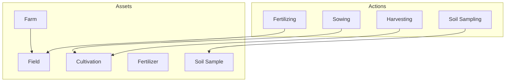

# The Asset-Action Model

The core architectural concept of the Farm Data Model (FDM) is the **Asset-Action Model**. This model provides a simple yet powerful way to represent the complex and dynamic nature of farm operations.

## Assets

**Assets** are the fundamental building blocks of the FDM. They represent the physical and logical entities that make up a farm, such as:

*   **Farms:** The top-level container for all other assets.
*   **Fields:** The primary spatial asset, representing a specific area of land.
*   **Cultivations:** An instance of a crop being grown on a field.
*   **Fertilizers:** A specific batch or acquisition of a fertilizer product.
*   **Soil Samples:** A physical sample of soil taken from a field.

## Actions

**Actions** are the events that create or modify assets over time. They represent the various activities that take place on a farm, such as:

*   **Sowing:** The action of planting a crop, which creates a new `cultivation` asset.
*   **Fertilizing:** The action of applying fertilizer to a field, which modifies the `field` asset.
*   **Harvesting:** The action of gathering a crop, which modifies the `cultivation` asset.
*   **Soil Sampling:** The action of taking a soil sample, which creates a new `soil sample` asset.

## How it Works

The Asset-Action Model creates a traceable history of all farm activities. Each action is linked to a specific asset, and the sequence of actions on an asset tells the story of that asset over time.

For example, the history of a `field` asset might look like this:

1.  **Create Field:** The `field` asset is created with its initial geometry and properties.
2.  **Sow Crop:** A `sowing` action is performed on the `field`, creating a new `cultivation` asset.
3.  **Apply Fertilizer:** A `fertilizing` action is performed on the `field`, adding nutrients to the soil.
4.  **Harvest Crop:** A `harvesting` action is performed on the `field`, gathering the crop and ending the `cultivation`.

This creates a complete and auditable record of everything that has happened on the farm, which is essential for traceability, compliance, and decision-making.

## Diagram

The following diagram illustrates the relationship between assets and actions:

